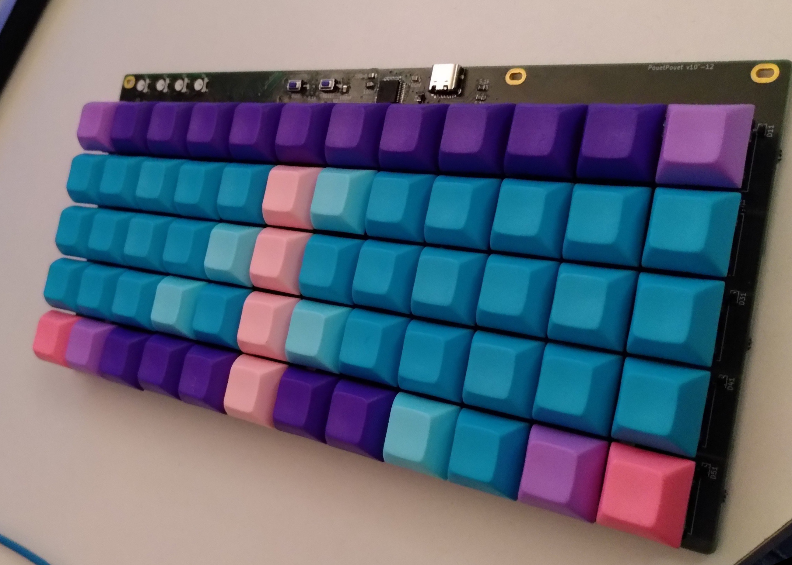
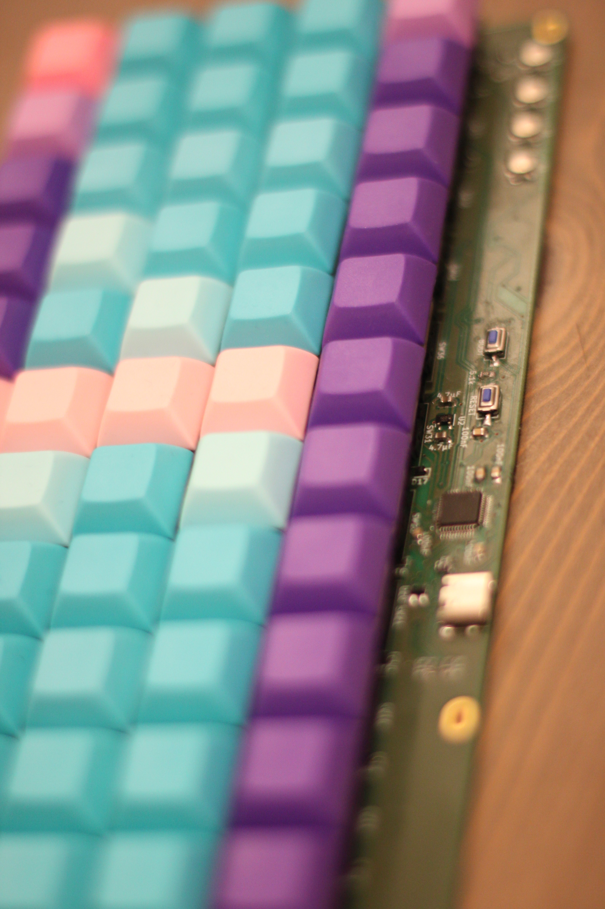
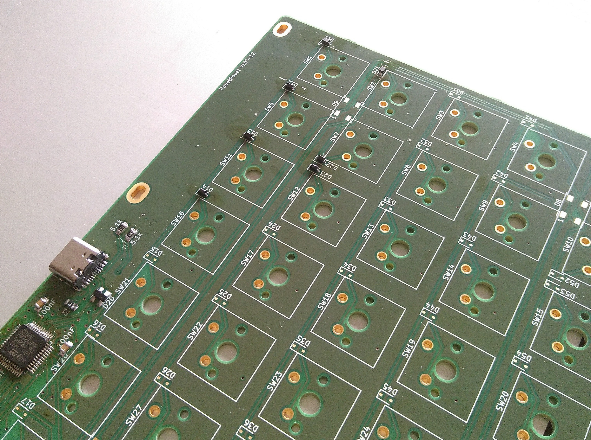
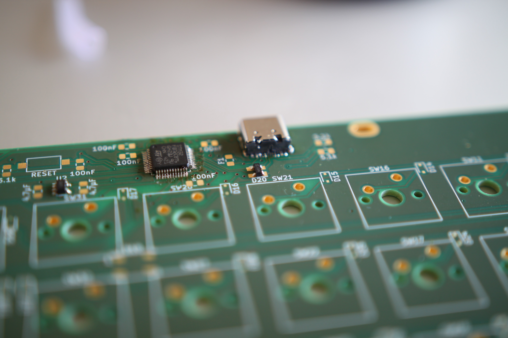
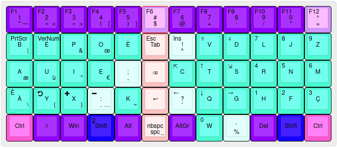
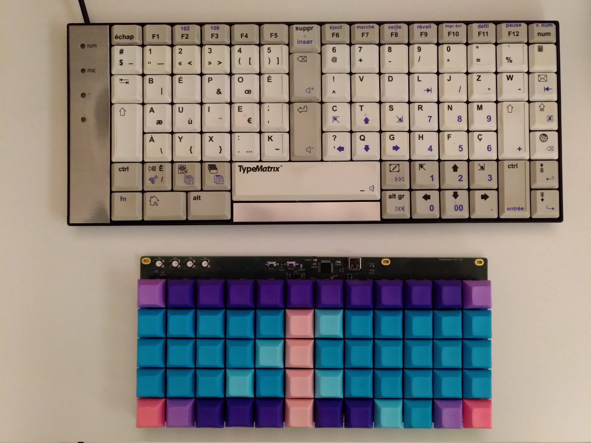

# PouetPouet

The firmware is [Keyberon](https://github.com/TeXitoi/keyberon), a
pure rust firmware.

The goal was:
* build a custom keyboard from scratch
* continue to learn embedded rust
* have fun




## Features

 * ortholinear
 * 60 keys, using Cherry MX switches, only 1U keycaps;
 * 4 RGB LEDs for status;
 * 6 RGB LEDs for backlight;
 * USB-C connector;
 * 1 STM32F072 MCU, with hardware USB DFU bootloader;
 * Only onboard SMD component (except for the switches).
 * ESD protection

## Inspiration

 * [Keyseebee](https://github.com/TeXitoi/keyseebee) for being the «I will
   change it quickly and have something ready in an hour» base project (even if
   I ended up redoing most of the hardware design). It was really nice to have a
   solid base to learn and bootstrap the project.
 * [Typematrix 2030](http://typematrix.com/2030/features.php): I own 2 of them
   and really love them. But both are getting old and some keys are not working
   correctly (this motivated the keyboard change).
 * [Steamvan](https://github.com/jmdaly/steamvan) for some KiCad design ideas;
 * [Preonic](https://olkb.com/collections/preonic) as a model: ortholinear, good
   balance between size/usability, simple.

## Usefull resources
 * [Mechanical Keyboard](https://github.com/help-14/mechanical-keyboard) is a list of DIY keyboards
 * [Awesome Mechanical Keyboard](https://github.com/BenRoe/awesome-mechanical-keyboard) is another [«awesome»](https://github.com/topics/awesome) list
 * [help-14](https://github.com/help-14/mechanical-keyboard) for making a nice
   list of existing keyboard;
 * [Masterzen](http://www.masterzen.fr/2020/05/03/designing-a-keyboard-part-1/)
   and many others for writing online tutorials for newbies like me.

## Build log

Disclaimer: I'm a software developper, this is my first real PCB design and my first try at SMD soldering: do not take anything here for granted :)

The project started as a quick-hack of Keyseebee to make it simpler but ended up
as a near full redesign. As every DIY project, the goal was to be quick and
simple (spoiler: it was neither).

Half of the parts have been soldered with a soldering iron (TS80P), the other
half with hot air station. Clearly, with my [un]existing soldering skills, the
hot air is a huge win. But I think I would have simply spent more time by only
using the iron. Even the small sod-323 diodes without the `_handsoldering` pads
(mistake) were not a real problem (tricky, but even I could do it).



The trickiest
part is the USB connector if you don't have a hot air station: the plastic
casing melts with the solder.



* The LEDs are mostly optional, and the 6 used for the backlight are nearly
  useless. I did not really study how to insert LEDs for a nice backlight and the
  result is not really satisfactory.
* I'll hopefully find time to use plexiglass plate to put below the PCB and
  above the visible part. I've added holes for this but never really planed
  anything really. If you really want something nice here, you may check this
  before.


## Layout

As a typematrix user, I really like the middle column with `backspace/enter/del`
so naturaly I've tried to do something similar. The [initial
layout](http://www.keyboard-layout-editor.com/##@_pcb:true;&@_c=#cf94ff&sm=cherry&sb=gateron;&=F1%0A%0A%0A%0A%0A%0A%0A%0A%0A#%0A$&_c=#8f00ff;&=F2%0A%0A%0A%E2%80%94%0A%0A%0A%0A%0A%0A1%0A%22&=F3%0A%0A%0A%3C%0A%0A%0A%0A%0A%0A2%0A%C2%AB&=F4%0A%0A%0A%3E%0A%0A%0A%0A%0A%0A3%0A%C2%BB&=F5%0A%0A%0A%5B%0A%0A%0A%0A%0A%0A4%0A(&=F6%0A%0A%0A%5D%0A%0A%0A%0A%0A%0A5%0A)&=F7%0A%0A%0A%0A%0A%0A%0A%0A%0A6%0A/@&=F8%0A%0A%0A%0A%0A%0A%0A%0A%0A7%0A+&=F9%0A%0A%0A%0A%0A%0A%0A%0A%0A8%0A-&=F10%0A%0A%0A%0A%0A%0A%0A%0A%0A9%0A//&=F11%0A%0A%0A%0A%0A%0A%0A%0A%0A0%0A*&_c=#cf94ff;&=F12%0A%0A%0A%0A%0A%0A%0A%0A%0A%C2%B0%0A/=;&@_c=#4bfad0;&=PrtScr%0A%0A%0A%7C%0A%0A%0A%0A%0A%0AB&=VerNum%0A%0A%0A%0A%0A%0A%0A%0A%0A%C3%89&=%0A%0A%0A/&%0A%0A%0A%0A%0A%0AP&=%0A%0A%0A%C5%93%0A%0A%0A%0A%0A%0AO&_a:7;&=%C3%88&_c=#fcc0c0&a:4;&=Esc%0A%0A%0A%0A%0A%0A%0A%0A%0ATab&_c=#dbfff7;&=Ins%0A%0A%0A%0A%0A%0A%0A%0A%0A!%0A%5E&_c=#4bfad0;&=/&uArr/;%0A%0A%0A%0A%0A%0A%0A%0A%0AV&=/&dArr/;%0A%0A%0A%0A%0A%0A%0A%0A%0AD&=7%0A%0A%0A%0A%0A%0A%0A%0A%0AL&=8%0A%0A%0A%0A%0A%0A%0A%0A%0AJ&=9%0A%0A%0A%0A%0A%0A%0A%0A%0AZ;&@=%0A%0A%0A%C3%A6%0A%0A%0A%0A%0A%0AA&=%0A%0A%0A%C3%B9%0A%0A%0A%0A%0A%0AU&=%0A%0A%0A%22%0A%0A%0A%0A%0A%0AI&=%0A%0A%0A%E2%82%AC%0A%0A%0A%0A%0A%0AE&_c=#dbfff7&a:5;&=%0A,%0A%0A%0A%0A%0A/;&_c=#fcc0c0&a:7;&=%3Ci%20class/='mss%20mss-Unicode-BackSpace-DeleteLeft-Big-2'%3E%3C//i%3E&_c=#4bfad0&a:4;&=%3Ci%20class/='kb%20kb-Arrows-Top-2'%3E%3C//i%3E%0A%0A%0A%0A%0A%0A%0A%0A%0AC&=/&uarr/;%0A%0A%0A%0A%0A%0A%0A%0A%0AT&=%3Ci%20class/='kb%20kb-Arrows-Bottom-2'%3E%3C//i%3E%0A%0A%0A%0A%0A%0A%0A%0A%0AS&=4%0A%0A%0A%0A%0A%0A%0A%0A%0AR&=5%0A%0A%0A%0A%0A%0A%0A%0A%0AN&=6%0A%0A%0A%0A%0A%0A%0A%0A%0AM;&@=%0A%0A%0A%5C%0A%0A%0A%0A%0A%0A%C3%80&=%0A%0A%0A%7B%0A%0A%0A%0A%0A%0AY&=%0A%0A%0A%7D%0A%0A%0A%0A%0A%0AX&_c=#dbfff7;&=%0A%0A%0A%E2%80%A6%0A%0A%0A%0A%0A%0A/:%0A.&_c=#4bfad0;&=%0A%0A%0A~%0A%0A%0A%0A%0A%0AK&_c=#fcc0c0&a:7;&=/&crarr/;&_c=#dbfff7&a:4;&=/&larr/;%0A%0A%0A%0A%0A%0A%0A%0A%0A?%0A'&_c=#4bfad0;&=/&darr/;%0A%0A%0A%0A%0A%0A%0A%0A%0AQ&=/&rarr/;%0A%0A%0A%0A%0A%0A%0A%0A%0AG&=1%0A%0A%0A%0A%0A%0A%0A%0A%0AH&=2%0A%0A%0A%0A%0A%0A%0A%0A%0AF&=3%0A%0A%0A%0A%0A%0A%0A%0A%0A%C3%87;&@_c=#ff59d1&a:7;&=Ctrl&_c=#1500ff;&=Shift&_c=#8f00ff;&=Win&=/&uArr/;&=Alt&_c=#fcc0c0&a:4;&=%0A%0A%0A/_%0A%0A%0A%0A%0A%0Anbspc%0Aspc&_c=#8f00ff&a:7;&=Del&=AltGr&_c=#dbfff7&a:5;&=%0A%25%0A%0A%0A%0A%0A%60&_c=#4bfad0&a:4;&=0%0A%0A%0A%0A%0A%0A%0A%0A%0AW&_c=#1500ff&a:7;&=Shift&_c=#ff59d1;&=Ctrl) has only the `%` and `w` key at different locations:




## Bill Of Materials

|Item                                                                      |Package|Qty|Remarks                                |Price |
|--------------------------------------------------------------------------|-------|--:|---------------------------------------|-----:|
| PCB                                                                      |       | 3 | [aisler](https://aisler.net/p/BWUOMHHS) |  86.40€  |
| 100 nF                                                                   | 0805  | 5 | magic match aisler                    | 0    |
| PRTR5V0U2X,215                                                           | sot-143| 1 |                                      | 0.43€ |
| 4.7 uF                                                                   | 0805  | 2 |                                       | 0    |
| 470 Ohm                                                                  | 0805  | 1 | magic match aisler                    | 0    |
| TLV70233DBVR                                                             | sot-23| 1 | magic match aisler                    | 0.37€ |
| 74LVC1G34GW,125                                                          |       | 1 | magic match aisler                    | 0.28€ |
| 0805L050WR (500mA Polyfuse)                                              | 0805  | 1 | magic match aisler                    | 1.91€ |
| RS282G05A3SMRT (micro switch)                                            |       | 2 | magic match aisler                    | 1.26€ |
| 100nF                                                                    | 0805  | 2 | magic match aisler                    | 0 |
| 5.1 kOhm                                                                 | 0805  | 3 | magic match aisler                    | 0 |
| 0805L050WR (500mA Polyfuse)                                              | 0805  | 1 | magic match aisler                    | 0 |
| 1N4148WS-7-F                                                             | sod-323 | 60|                                     |   |
| [WS2812B](https://www.aliexpress.com/item/4000750610574.html?spm=a2g0s.9042311.0.0.27424c4dS3DGkH)                                                                  |       | 10|                                       | 1€  |
| [USB TypeC HRO Receptacle](https://www.aliexpress.com/item/33056042016.html?spm=a2g0s.9042311.0.0.1d8b4c4d8WcR7j)                                                 |       | 1 |                                       |   |
| Gateron Switch                                                           |       | 60|                                       |   |
| Keycaps                                                                  |       | 60|                                       |   |

## Compiling and flashing

Install the complete toolchain and utils:

```shell
curl https://sh.rustup.rs -sSf | sh
rustup target add thumbv6m-none-eabi
rustup component add llvm-tools-preview
cargo install cargo-binutils
sudo apt-get install dfu-util
```

Compile:

```shell
cd firmware
cargo objcopy --bin pouetpouet --release -- -O binary pouetpouet.bin
```

To flash using dfu-util, first put the board in dfu mode by pressing
BOOT, pressing and releasing RESET and releasing BOOT. Then:

```shell
dfu-util -d 0483:df11 -a 0 -s 0x08000000:leave -D pouetpouet.bin
```

The fist time, if the write fail, your flash might be protected. To
unprotect:

```shell
dfu-util -d 0483:df11 -a 0 -s 0x08000000:force:unprotect -D pouetpouet.bin
```
